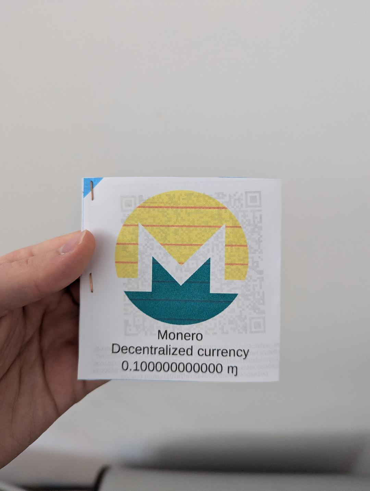

# Monero Paper Wallet

## Known issues

The template is hardcoded for amounts of 0.1XMR per paper wallet. You can change it with LibreOffice in `resources/template.odg`.

Other than that, everything should work.

## How to use

In the Monero wallet GUI, export the wallet keys:
- Settings
- Show seeds and keys
- Export wallet
- Scan both the Spendable Wallet and the View Only Wallet

If you do not know how to scan a QR-code, you can use the `zbarimg` command on Debian-based distros (from the `zbar-tools` apt package).

You can automate the process of generating and exporting wallet keys with the Monero Wallet RPC (see [this gist](https://gist.github.com/yacinecheikh/8d3cf29d4a126c21dbd8637dfdbfc6bd)).

Once you have the keys, run `./scripts/gen-pdf "<audit_key>" "<spend_key>"` and replace `<audit_key>` and `<spend_key>` by the keys you exported from your wallet.
You must run this script from the main directory of this project, or the paths will break.

When printing the resulting PDF, you should print both pages on the same piece of paper, fold it in half to make a square, and use staples on the open side to seal the inside.
Here is an example of what I got with a printer that cannot print orange and translucid paper:

## Requirements

- zip
- qrencode
- libreoffice
- python3

